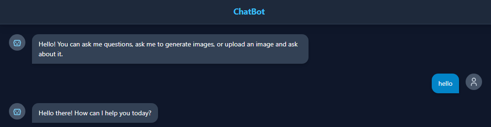
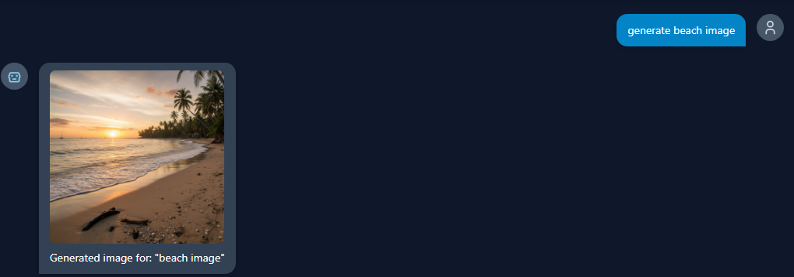
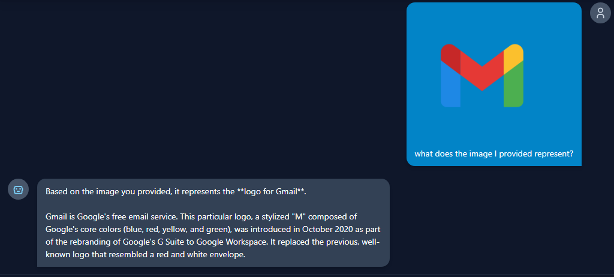

# 💬 Chatbot (React + TypeScript)

An intelligent, multimodal chatbot powered by **Google Gemini API**, built using **React** and **TypeScript**.  
This chatbot can **generate text and images**, **analyze uploaded pictures**, and **process documents or files** — all through an elegant web interface.

---

## 🚀 Features

✅ **Text Generation** – Ask any question and receive contextual, high-quality responses.  
🖼️ **Image Generation** – Create images based on text prompts.  
👁️ **Vision Capability** – Upload or attach images and ask questions about their content.  
📁 **File Understanding** – Attach documents (PDFs, text files, etc.) and ask questions about them.  
⚡ **Modern UI** – Built with React + TypeScript for performance and maintainability.  
🔒 **Secure API Integration** – Uses the official Google Gemini API via environment variables.

---

## 🛠️ Installation & Setup

Follow these steps to run the project locally:

### 1️⃣ Clone the Repository
```bash
git clone https://github.com/your-username/gemini-chatbot.git
cd gemini-chatbot
```
### 2️⃣ Install Dependencies
```bash
npm install
```
### 3️⃣ Add Environment Variables
```bash
GEMINI_API_KEY="your_google_gemini_api_key_here"
```
### 4️⃣ Run the Development Server
```bash
npm run dev
```
---
## 📸 Screenshots

Below are screenshots of the chatbot in action (located in the static/ folder):

<p align="center">
  
  
  
</p>
